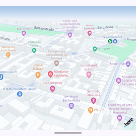
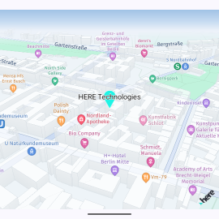
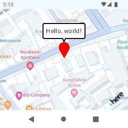
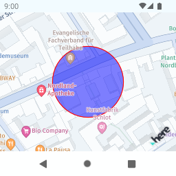
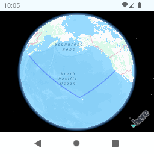

# HERE SDK for MapConductor Android

## Description

MapConductor provides a unified API for Android Jetpack Compose.
You can use HERE view with Jetpack Compose, but you can also switch to other Maps SDKs (such as MapLibre, Google Maps, and so on), anytimes.
Even you use the wrapper API, but you can still access to the native HERE view if you want.

## Setup

https://docs-android.mapconductor.com/setup/here/

## Usage

```kotlin
@Composable
fun MapView(modifier: Modififer = Modififer) {
    var selectedMarker by remember { mutableStateOf<MarkerState?>(null) }

    val center = GeoPoint(
        latitude = 52.530909,
        longitude = 13.385076,
    )

    val mapViewState =
        rememberHereMapViewState(
            cameraPosition =
                MapCameraPosition(
                    position = center,
                    zoom = 11.0,
                ),
        )

    val markerState = remember { MarkerState(
            position = center,
            icon = DefaultMarkerIcon().copy(
                label = "HERE Technologies",
                fillColor = Color(
                    red = 31,
                    green = 244,
                    blue = 229,
                )
            ),
            onClick = {
                selectedMarker = it
            }
        )
    }

    HereMapView(
        state = mapViewState,
        modifier = modifier,
    ) {
        Marker(markerState)

        selectedMarker?.let {
            InfoBubble(
                marker = it,
            ) {
                Text("Hello, world!")
            }
        }
    }
}
```


## Components

### HereMapView [[docs]](https://docs-android.mapconductor.com/components/mapviewstate/)

```kotlin
@Composable
fun MapExample() {
    val initCameraPosition = MapCameraPosition(
        position = GeoPoint(
            latitude = 52.530909,
            longitude = 13.385076
        ),
        zoom = 17.0,
        tilt = 60.0,
        bearing = 30.0,
    )
    
    val mapViewState = rememberHereMapViewState(
        cameraPosition = initCameraPosition,
    )

    HereMapView(mapViewState)
}
```


------------------------------------------------------------------------

### Marker [[docs]](https://docs-android.mapconductor.com/components/marker/)

```kotlin
@Composable
fun MarkerExample() {
    val markerState = remember { MarkerState(
        position = GeoPoint(...),
        icon = DefaultMarkerIcon().copy(
            label = "HERE Technologies",
        ),
        onClick = {
            it.animate(MarkerAnimation.Bounce)
        },
    ) }

    HereMapView(state = mapViewState) {
        Marker(markerState)
    }
}
```


------------------------------------------------------------------------

### InfoBubble [[docs]](https://docs-android.mapconductor.com/components/infobubble/)

```kotlin
@Composable
fun InfoBubbleExample() {
    var selectedMarker by remember { mutableStateOf<MarkerState?>(null) }

    val markerState = remember { MarkerState(
        ...,
        onClick = {
            selectedMarker = it
        },
    ) }

    HereMapView(state = mapViewState) {
        Marker(markerState)
        InfoBubble(
            marker = it,
        ) {
            Text("Hello, world!")
        }
    }
}
```


------------------------------------------------------------------------

### Circle [[docs]](https://docs-android.mapconductor.com/components/circle/)

```kotlin
@Composable
fun CircleExample() {

    val circleState = remember { CircleState(
        center = GeoPoint(...),
        radiusMeters = 50.0,
        fillColor = Color.Blue.copy(alpha = 0.5f),
        onClick = {
            it.state.fillColor = Color.Red.copy(alpha = 0.5f)
        }
    ) }

    HereMapView(state = mapViewState) {
        Circle(circleState)
    }
}
```


------------------------------------------------------------------------

### Polyline [[docs]](https://docs-android.mapconductor.com/components/polyline/)

```kotlin
@Composable
fun PolylineExample() {

    val polylineState = remember { PolylineState(
            points = airpots,
            strokeColor = Color.Blue.copy(alpha = 0.5f),
        ) }

    HereMapView(state = mapViewState) {
        Polyline(polylineState)
    }
}
```

