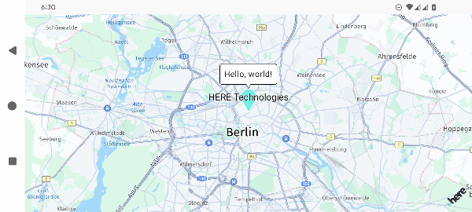

# HERE SDK for MapConductor Android

## Description

MapConductor provides a unified API for Android Jetpack Compose.
You can use HERE view with Jetpack Compose, but you can also switch to other Maps SDKs (such as MapLibre, GoogleMaps, and so on), anytimes.
Even you use the wrapper API, but you can still access to the native HERE view if you want.

## Setup

https://docs-android.mapconductor.com/setup/here/

## Usage

```kotlin
@Composable
fun MapView(modifier: Modififer = Modififer) {
    var selectedMarker by remember { mutableStateOf<MarkerState?>(null) }

    val center = GeoPoint(
        latitude = 52.530909,
        longitude = 13.385076,
    )

    val mapViewState =
        rememberHereMapViewState(
            cameraPosition =
                MapCameraPosition(
                    position = center,
                    zoom = 11.0,
                ),
        )

    val markerState = remember { MarkerState(
            position = center,
            icon = DefaultMarkerIcon().copy(
                label = "HERE Technologies",
                fillColor = Color(
                    red = 31,
                    green = 244,
                    blue = 229,
                )
            ),
            onClick = {
                selectedMarker = it
            }
        )
    }

    HereMapView(
        state = mapViewState,
        modifier = modifier,
    ) {
        Marker(markerState)

        selectedMarker?.let {
            InfoBubble(
                marker = it,
            ) {
                Text("Hello, world!")
            }
        }
    }
}
```


