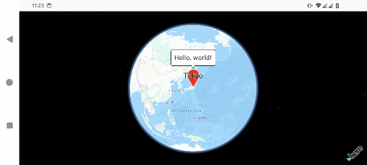
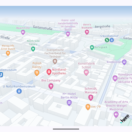
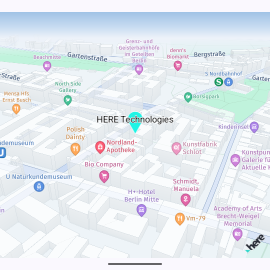
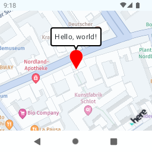
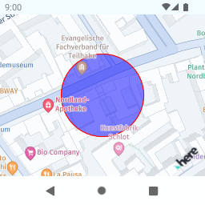
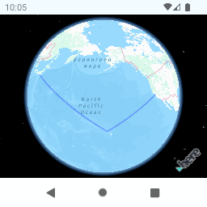
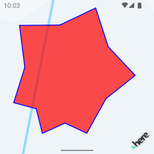
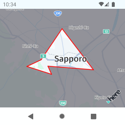
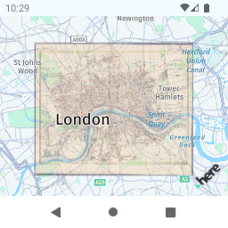

# HERE SDK for MapConductor Android

## Description

MapConductor provides a unified API for Android Jetpack Compose.
You can use HERE view with Jetpack Compose, but you can also switch to other Maps SDKs (such as MapLibre, Google Maps, and so on), anytimes.
Even you use the wrapper API, but you can still access to the native HERE view if you want.

## Setup

https://mapconductor.com/setup/android/here/

### API key

HERE needs **two** values, both read from `AndroidManifest.xml`:

```xml
<meta-data android:name="HERE_ACCESS_KEY_ID" android:value="${HERE_ACCESS_KEY_ID}" />
<meta-data android:name="HERE_ACCESS_KEY_SECRET" android:value="${HERE_ACCESS_KEY_SECRET}" />
```

Put the value in `secrets.properties` and let the Secrets Gradle Plugin inject it; keep that file out of source control.

## Usage

```kotlin
@Composable
fun MapView(modifier: Modififer = Modififer) {
    var selectedMarker by remember { mutableStateOf<MarkerState?>(null) }

    val center = GeoPoint(
        latitude = 35.6762,
        longitude = 139.6503,
    )

    val mapViewState =
        rememberHereMapViewState(
            cameraPosition =
                MapCameraPosition(
                    position = center,
                    zoom = 2.0,
                ),
        )

    val markerState = remember { MarkerState(
        position = center,
        icon = DefaultMarkerIcon().copy(
            label = "Tokyo",
        ),
        onClick = {
            selectedMarker = it
        }
    )
    }

    HereMapView(
        state = mapViewState,
        modifier = modifier,
    ) {
        Marker(markerState)

        selectedMarker?.let {
            InfoBubble(
                marker = it,
            ) {
                Text("Hello, world!")
            }
        }
    }
}
```




## Components

### HereMapView [[docs]](https://mapconductor.com/mapview/)

```kotlin
@Composable
fun MapExample() {
    val initCameraPosition = MapCameraPosition(
        position = GeoPoint(
            latitude = 52.530909,
            longitude = 13.385076
        ),
        zoom = 17.0,
        tilt = 60.0,
        bearing = 30.0,
    )

    val mapViewState = rememberHereMapViewState(
        cameraPosition = initCameraPosition,
    )

    HereMapView(mapViewState)
}
```


------------------------------------------------------------------------

### Marker [[docs]](https://mapconductor.com/markers/)

```kotlin
@Composable
fun MarkerExample() {
    val markerState = remember { MarkerState(
        position = GeoPoint(...),
        icon = DefaultMarkerIcon().copy(
            label = "HERE Technologies",
        ),
        onClick = {
            it.animate(MarkerAnimation.Bounce)
        },
    ) }

    HereMapView(...) {
        Marker(markerState)
    }
}
```


------------------------------------------------------------------------

### InfoBubble [[docs]](https://mapconductor.com/info-bubble/)

```kotlin
@Composable
fun InfoBubbleExample() {
    var selectedMarker by remember { mutableStateOf<MarkerState?>(null) }

    val markerState = remember { MarkerState(
        ...,
        onClick = {
            selectedMarker = it
        },
    ) }

    HereMapView(...) {
        Marker(markerState)
        selectedMarker?.let {
            InfoBubble(
                marker = it,
            ) {
                Text("Hello, world!")
            }
        }
    }
}
```


------------------------------------------------------------------------

### Circle [[docs]](https://mapconductor.com/circle/)

```kotlin
@Composable
fun CircleExample() {

    val circleState = remember { CircleState(
        center = GeoPoint(...),
        radiusMeters = 50.0,
        fillColor = Color.Blue.copy(alpha = 0.5f),
        onClick = {
            it.state.fillColor = Color.Red.copy(alpha = 0.5f)
        }
    ) }

    HereMapView(...) {
        Circle(circleState)
    }
}
```


------------------------------------------------------------------------

### Polyline [[docs]](https://mapconductor.com/polyline/)

```kotlin
@Composable
fun PolylineExample() {

    val polylineState = remember { PolylineState(
            points = airpots,
            strokeColor = Color.Blue.copy(alpha = 0.5f),
            geodesic = true,
        ) }

    HereMapView(...) {
        Polyline(polylineState)
    }
}
```


------------------------------------------------------------------------

### Polygon [[docs]](https://mapconductor.com/polygon/)

```kotlin
@Composable
fun PolygonExample() {

    val polygonState = remember { PolygonState(
        points = goryokaku,
        strokeColor = Color.Red.copy(alpha = 0.5f),
        fillColor =  Color.Red.copy(alpha = 0.7f),
    ) }

    HereMapView(...) {
        Polygon(polygonState)
    }
}
```


------------------------------------------------------------------------

### Polygon Hole

```kotlin
@Composable
fun PolygonExample() {

    val polygonState =
        remember {
            PolygonState(
                points = listOf(...),
                holes = listOf(
                            listOf(...),
                            listOf(...),
                        ),
                fillColor = Color(0xCC787880),
                strokeColor = Color.Red,
                strokeWidth = 2.dp,
            )
        }

    HereMapView(...) {
        Polygon(polygonState)
    }
}
```


------------------------------------------------------------------------
### GroundImage [[docs]](https://mapconductor.com/ground-image/)

```kotlin
@Composable
fun GroundImageExample() {
    val groundImageState = remember { GroundImageState(
        bounds = GeoRectBounds(
            southWest = GeoPoint.fromLatLong(...),
            northEast = GeoPoint.fromLatLong(...),
        ),
        image = image,
        opacity = 0.5f,
    ) }

    HereMapView(state = mapViewState) {
        GroundImage(groundImageState)
    }
}
```


